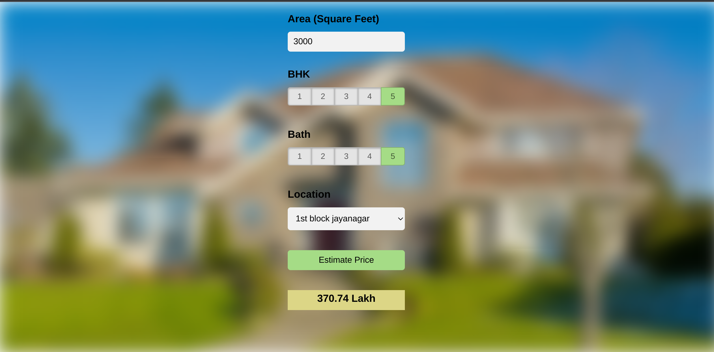

# House-price-prediction-system

### This is an end to end regression project that predicts the prices of Houses.  
The model was trained on Bengaluru House price data from kaggle.
We first build a model using sklearn and linear regression using banglore home prices dataset from kaggle.com. 
Second step would be to write a python flask server that uses the saved model to serve http requests. 
Third component is the website built in html, css and javascript that allows user to enter home square ft area, bedrooms etc and it will call python flask server to retrieve the predicted price. During model building we will cover almost all data science concepts such as data load and cleaning, outlier detection and removal, feature engineering, dimensionality reduction, gridsearchcv for hyperparameter tunning, k fold cross validation etc.   
## Project Architecture

## Technology and tools used in this project include:
1) Python
2) Numpy and Pandas for data cleaning
3) Matplotlib for data visualization
4) Sklearn for model building
5) Jupyter notebook, visual studio code
6) Python flask for http server
7) HTML/CSS/Javascript for UI

## Project Demo
http://localhost:63342/Regression%20Project:%20Bangalore%20property%20price%20prediction/client/app.html?_ijt=jp5d3imiqotae0m79dfv7eal4h&_ij_reload=RELOAD_ON_SAVE
